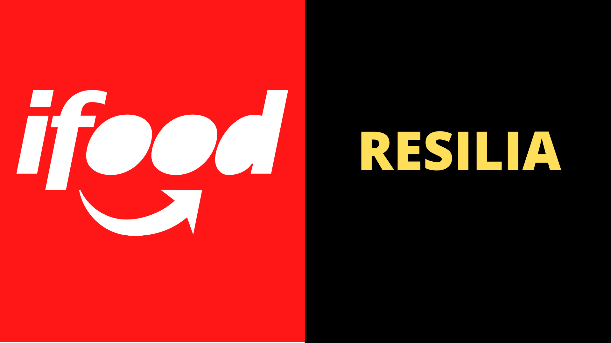

# CASE IFOOD - VAMO AI
### _PROJETO FINAL DO CURSO RESILIA EM PARCERIA COM IFOOD_ <center>



> #### Foi proposto como desafio: Organizar um percurso sobre dados em Aplicativos de uso comum. O objetivo principal era que os integrantes do grupo mostrassem seus conhecimentos em storytelling.

#

## Informações sobre o grupo: 

A apresentação do trabalho foi realizada no curso da Resilia e parceria com o Ifood. O projeto tem o nome de VAMOAI e o seu intuito é formar programadores de baixa renda e que possuem muita garra e vontade de aprender. O trabalho contou com 3 integrantes: Mariãn, Nathan e Ana. 

#

### _Tema escolhido pelo grupo_:
#### O grupo escolheu o tema da Alice no País das maravilhas. O intuito era realizar uma alusão a questão do tempo que a trama de Alice no País das maravilhas carrega.Por meio da apresentação da história de Nathan e de seus dados, apresentamos o que ele fez durante o seu percurso profissional através do tempo. E com isso, mostramos a parte da história de vida dele que tinha um início no fim do seu ensino médio e final conclusivo com o curso do VAMOAI. 

#

### _Construção do projeto_:
#### Sabendo do objetivo principal, o grupo cumpriu 3 etapas de organização e construção do projeto:


### _**Por meio da utilização de metodologias ágeis foi possível realizar as seguintes etapas:**_ <center>


| ETAPAS | GIF |
| ------ | ------ |
| _**Product backlog**_ do que queriamos para o resultado final|  |
| _**Sprint Backlog**_ na qual listamos as atividades que deveriam ser realizadas nas sprints |  |
| _**Daily**_ durante todo o processo de construção. Assim como reuniões com períodos maiores com duração de 6hs diárias para construção do projeto.|  |
| _**Produto Final**_|  |


#


>## Conteúdo utilizado:

```sh
Python
POO
Biblioteca Pandas, Numpy, Matplotlib
Princípios SOLID
JSON
```

Ferramentas e metodologias:

```sh
Watssap
Discord
Drive/Google
Trello
Git
Github
PyCharm
VsCode
```

## Resultados do projeto:

> _**Importante destacar que**_ : Durante a construção do projeto foi possível ter uma experiência Data Driven sobre as informações de cada um. Com isso, colocamos em prática os conhecimentos de programação, além da oportunidade de conhecer o nosso comportamento por meio dos dados que manipulamos.


Utilizamos princípios de Soft Skils para a estruturação e organização do processo de construção do programa. Como resultado obtivemos:

| Resultados | GIF |
| ------ | ------ |
| Construção de aprendizado juntos.|  |
| Respeito a limitação de cada um , e extraindo o melhor de cada a partir daí. |   | |
| Tudo que foi planejado em relação às reuniões foi concluído.|  |
| Consolidação dos conteúdos do curso. ||

#

>Tem interesse em nos conhecer? Visite o Github do grupo no link: [ Mariãn](https://github.com/mariandocarmo) ,[ Nathan](https://github.com/nathan-cutrin) e [Ana](https://github.com/soaresana).

#


## AGRADECIMENTOS:
```sh
A colaboração dos mebros grupo foi imprescindível para o sucesso deste trabalho. Foi sensacional poder  conhecer a história de cada um e contar principalmente com a dedicação! Que este trabalho traga para o público muito conhecimento em relação a exploração de dados e a importância de se construir parcerias durante a vida! Foi incrível viver esta experiência de 6 meses e VamoAi! 
```

#

## Referências:
>BLOG, Dark. Cinco Reflexões presnetes e Alice no País das maravilhas.DarkBlog. Disponível em: <https://darkside.blog.br/cinco-reflexoes-presentes-em-alice-no-pais-das-maravilhas/>. Acesso em: 26 jul. 2021.


